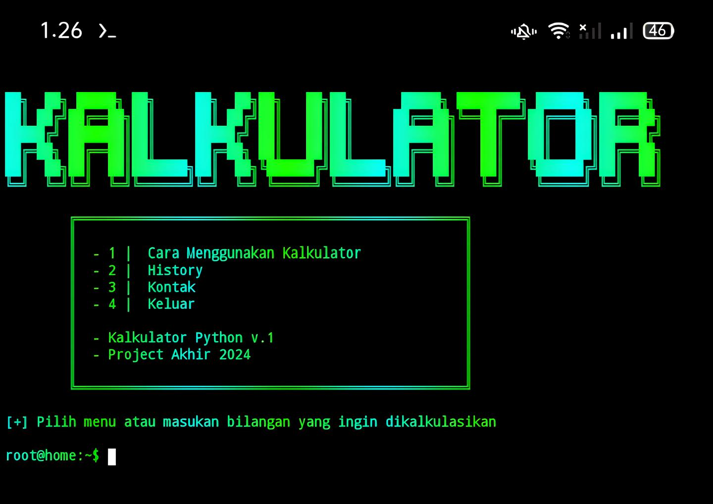
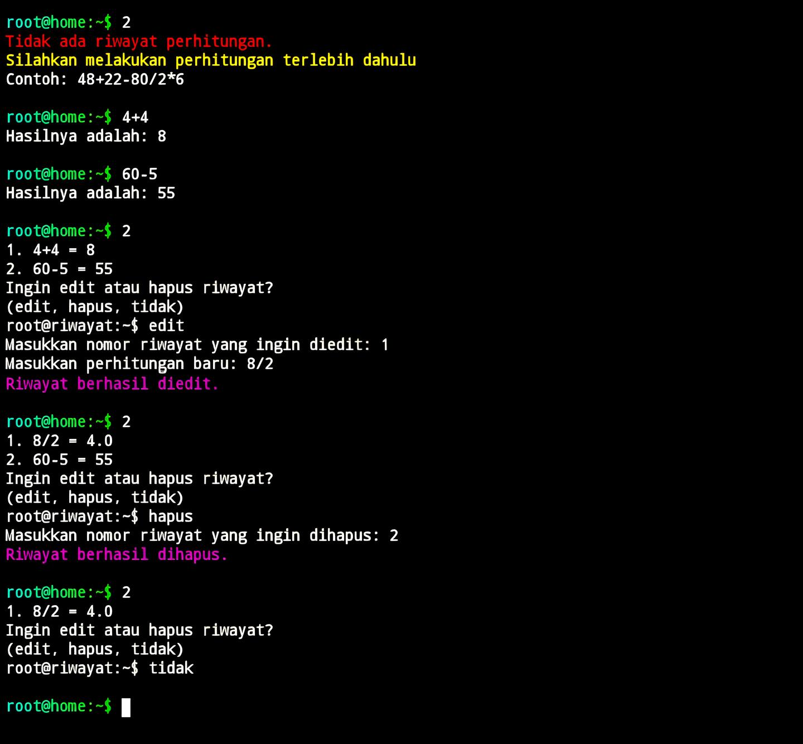

<h1 align="center">PROJECT AKHIR PYTHON</h1>

Proyek ini adalah sebuah aplikasi kalkulator sederhana berbasis **CLI (Command Line Interface)** yang dibuat menggunakan Python. Kalkulator ini mendukung operasi matematika dasar seperti penjumlahan, pengurangan, perkalian, dan pembagian. Selain itu, program ini dilengkapi dengan fitur riwayat perhitungan, tutorial, serta informasi kontak developer.
Proyek ini merupakan **Project Akhir 2024** dari **11 TKJ 1 SMEKSA**.

---

## Fitur
- **Perhitungan Dasar**: Penjumlahan (+), Pengurangan (-), Perkalian (*), dan Pembagian (/).
- **Riwayat Perhitungan**:
  - Menampilkan riwayat perhitungan.
  - Mengedit atau menghapus riwayat perhitungan.
- **Interaktif**:
  - Menu Tutorial.
  - Menu Kontak Developer.
- **Efek Visual**:
  - Warna-warna menarik di terminal menggunakan modul `colorama` dan `pystyle`.

---

## Tampilan Program
### Tampilan Awal
Gambar tampilan awal:  


### Riwayat Perhitungan
Gambar tampilan riwayat:  


---

## Termux
```bash
apt update -y && apt upgrade -y
apt install git -y
apt install python -y
git clone https://github.com/MarvellAlvin/Project-Akhir-Kalkulator-Python
cd Project-Akhir-Kalkulator-Python
pip install -r install.txt
python main.py
```

## Terminal Vps Ubuntu 
```bash
apt update && apt upgrade
apt install git -y
apt install python3-pip
git clone https://github.com/MarvellAlvin/Project-Akhir-Kalkulator-Python
cd Project-Akhir-Kalkulator-Python
pip3 install -r install.txt
python3 main.py
```

---

## Cara Menggunakan
1. **Jalankan Program**:
   - Pastikan Python terinstal di komputer Anda.
   - Jalankan program dengan mengetik:
     ```bash
     python main.py
     ```

2. **Navigasi Menu**:
   - Ketik bilangan atau ekspresi matematika langsung (contoh: `48+22-80/2*6`) untuk melakukan perhitungan.
   - Gunakan menu interaktif:
     - `1`: Melihat tutorial penggunaan.
     - `2`: Melihat, mengedit, atau menghapus riwayat perhitungan.
     - `3`: Melihat informasi kontak author.
     - `4`: Keluar dari program.

3. **Fitur Riwayat**:
   - Pilih menu `2` untuk melihat riwayat perhitungan.
   - Anda dapat:
     - Mengedit riwayat dengan memilih `edit` dan memasukkan perhitungan baru.
     - Menghapus riwayat dengan memilih `hapus`.
     - Keluar dari menu riwayat dengan memilih `tidak`.

---

## Dependencies
Program ini menggunakan beberapa modul Python. Pastikan semua modul berikut sudah terinstal:
- **os**: Modul bawaan untuk operasi sistem.
- **sys**: Modul bawaan untuk mengakses fungsi interpreter Python.
- **time**: Modul bawaan untuk kontrol waktu.
- **pystyle**: Untuk memberikan warna dan efek gaya pada terminal.
- **colorama**: Untuk menambahkan warna pada output terminal.

### Informasi
- **Kalkulator Python v.1** adalah kalkulator sederhana yang menggunakan script Python sepenuhnya sehingga mudah dipahami dan bersifat open source untuk diedit.  
- Program Kalkulator ini dibuat untuk **Project Akhir** jurusan TKJ 1.  
- Awal pembuatan kalkulator ini bukan hanya untuk project akhir, tetapi juga keinginan saya untuk belajar dan mengeksplorasi hal baru.  
- Program Python ini dibuat oleh **Marvell**, dengan bantuan **AI** dan **Teman-teman saya**.  
- Ke depannya saya berencana mengupdate program ini untuk meningkatkan skill saya dalam pemrograman Python.  
- Saya, Marvell, Berterimakasih kepada **Bu Alfi** dan **Teman-teman** yang sudah membantu serta memberikan ilmu kepada saya. 
